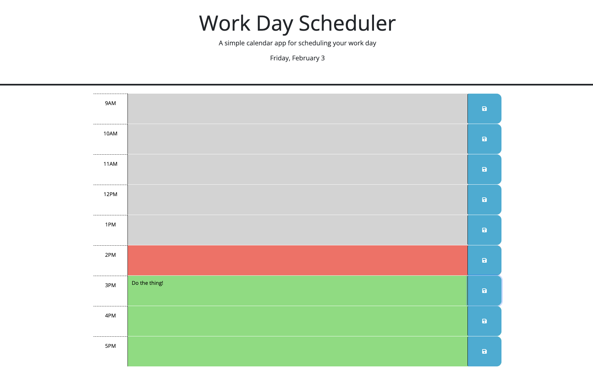

# Work-Day-Scheduler
challenge 05
Simple overview of use/purpose.
[Work Day Scheduler](https://allisonnault.github.io/Work-Day-Scheduler/)

## Description

We created a simple calendar application that allows a user to save events for each hour of the day. This app runs in the browser and features dynamically updated HTML and CSS powered by jQuery.

Through this project 
- I gained experience using jQuery and 3rd party API's like days.js
- I gained a better understanding of how to use local storage
- I gained a better understanding of how to use Javascript to dynamically modify HTML and CSS

## Usage

WHEN the user opens the application
THEN the current day is displayed at the top of the calendar
WHEN the user scolls down
THEN they are presented with timeblocks for standard business hours
WHEN the user views the timeblocks for that day
THEN each timeblock is color coded to indicate whether it is in the past, present, or future
WHEN the user clicks into a timeblock
THEN they can enter an event
WHEN the user clicks the save button for that timeblock
THEN the text for that event is saved in local storage
WHEN the user refreshs the page
THEN the saved events persist 

## License

Please refer to the MIT license in the repo